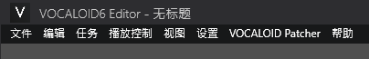

# VOCALOID Patcher
一个用于为 `VOCALOID 6` 编辑器提供本地化的补丁, 理论上支持所有版本的 V6 编辑器

### 翻译条目版本: `6.12.0.1`
### 已测试的编辑器版本: `6.6.0`, `6.11.0.1`, `6.12.0.1`

提交反馈/技术交流/单纯聊天 请加入 `422827160`  
我没有什么使用 V6 编辑器的经验, 所以可能会出现翻译不准确的情况。开个 issue 或者加群反馈给我, 然后下个版本我会修改翻译。

## 使用方法
前往 [Releases](https://github.com/IzumiiKonata/VOCALOIDPatcher/releases) 中下载最新发行版  
将压缩包中的所有文件 _(除了 README.txt)_ 复制并替换到 `C:\Program Files\VOCALOID6\Editor` 中 (如果编辑器没有安装在默认目录中可能会有问题)  
打开编辑器并打开一个工程, 如果菜单栏中出现 `VOCALOID Patcher` 选项则安装成功。  

## 调试
安装该补丁后, 在打开 `VOCALOID 6` 编辑器时长按 `左 Shift` 会打开控制台, `VOCALOIDPatcher` 会在其中显示一些 Debug 日志。

## 更新翻译
拉取项目, 运行 `ResourceTranslationComparer`, 控制台中会输出待翻译的条目

## 开发

### 注意事项
你需要在默认目录中 `(C:\Program Files\VOCALOID6\Editor)` 安装一份最新的 VOCALOID6 编辑器  
使用 `dotnet tool install -g dotnet-ilrepack` 命令安装 `ilrepack` 工具。  
复制一份 .net 8.0 的 `0Harmony.dll` (通常在 `C:\Users\<UserName>\.nuget\packages\lib.harmony\2.4.2\lib\net8.0\` 中) 到 `VOCALOIDPatcher\bin\Release\net8.0-windows` 中    
编译完成后, 会自动运行 `ilrepack` 工具, 构建一个包含依赖的 `Microsoft.Xaml.Behaviors.dll`, 输出目录是 `VOCALOIDPatcher\bin\Release\net8.0-windows\out`。

