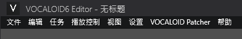
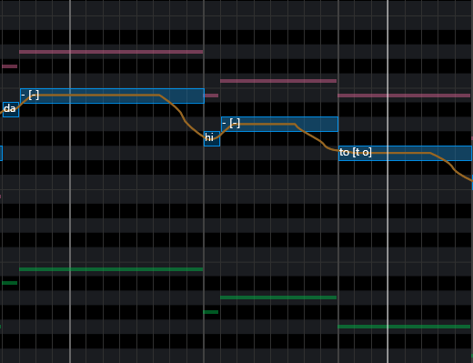
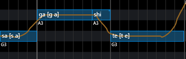
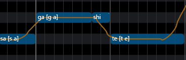
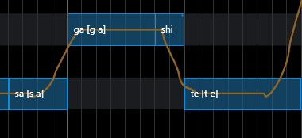
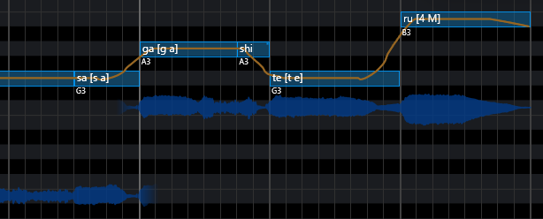

# VOCALOID Patcher

[](./README.MD)
[](./README_EN.MD)

VOCALOID Patcher は `VOCALOID 6 Editor` に直接読み込まれ、画面の翻訳、ピアノロールの補助機能、一括処理ツール、プロジェクト形式の変換を追加するパッチです。

- 翻訳データ：`6.13.1.1`
- 動作確認済み：`6.6.0`、`6.11.0.1`、`6.12.0.1`、`6.13.0.1`、`6.13.1.1 (Latest)`

作者自身が VOCALOID 6 を常用しているわけではないため、すべてのプロジェクトを網羅できているわけではありません。翻訳や変換の問題を報告する際は、エディターのバージョン、元の形式、再現手順、可能であれば最小構成のサンプルプロジェクトを添えてください。

## インストール

1. [Releases](https://github.com/IzumiiKonata/VOCALOIDPatcher/releases) から最新版をダウンロードします。
2. 旧バージョンのVOCALOID 6（`6.3.0` 以前のバージョン）は、バージョン `2.3.1` 以降ではサポートされません。旧バージョンのエディタを使用しており、パッチを適用した後に起動できない場合は、`_NET6` という拡張子が付いた `2.3.0` バージョンのビルドをダウンロードしてください。
3. `README.txt` を除くファイルを `C:\Program Files\VOCALOID6\Editor` にコピーし、既存のファイルを上書きします。
4. エディターを起動してプロジェクトを開きます。メニューバーに `VOCALOID Patcher` が表示されれば導入完了です。

VOCALOID 6 を別の場所にインストールしている場合は、実際の Editor ディレクトリへコピーしてください。



## 機能

### 画面の翻訳

エディターのリソースと、一部のハードコードされたラベルを翻訳します。翻訳は外部 XML ファイルに保存されているため、パッチを再ビルドせずに言語の切り替えや修正ができます。

### ピアノロール

- 現在のピアノロールに他トラックのノートを表示します。ミュート中のトラックは除外できます。
- ノート上に `C4`、`F#3` などの音名を表示します。
- 角丸ノート、歌詞の垂直中央揃え、波形の常時表示。
- 右下に現在のボイスバンクのカバーを表示します。ボイスバンクごとに立ち絵、サイズ、不透明度を設定できます。
- 静止画、アニメーション `GIF`、`MP4` などの動画に対応します。
- タッチパッドによるピアノロールの横スクロール。







### 一括処理ツール

- 選択したノートの歌詞をまとめて置換します。
- 現在のグリッドに合わせてノートの長さをクォンタイズします。
- 3 度からオクターブまでの上下ハモリを生成し、既存または新規トラックへ書き込みます。
- ピアノロールの右クリックメニューから、8 分・16 分の Swing / Shuffle プリセットを適用します。

### プロジェクト形式の変換

エディターが標準で扱う形式に加えて、次の形式をインポート・エクスポートできます。

`USTX`、`UST`、`SVP`、`S5P`、`VSQ`、`VSQX`、`VPR`、`CCS`、`TSSln`、`ACEP`、`VVProj`、`PPSF`、`DV`、`TLPX`、`TLP`、`SVIP`、`DS`、`AISP`、`Y77`、`VOG`、`MusicXML`、`OpenSVIP JSON`、`UFData`。

歌詞は `LRC`、`SRT`、`ASS` として書き出すこともできます。

変換処理は [LibreSVIP](https://github.com/SoulMelody/LibreSVIP) から移植し、VOCALOID 6 のプロジェクトモデルに合わせて調整しています。

- ファイル選択後、その形式で利用できる変換設定を表示します。ドラッグ＆ドロップでも同じ設定を使用します。
- ピッチ、音量、ブレシネス、ジェンダー、強さのカーブを VOCALOID のコントローラーと相互変換します。
- SVP の読み込みでは、既定のビブラート、Instant Pitch、ブレスノート、ノートグループを処理します。ビブラートの振幅計算は LibreSVIP 本家に合わせています。
- 形式に伴奏トラックが含まれている場合は、そのトラックも引き継ぎます。VPR の埋め込み音声は必要に応じて展開できます。
- 歌詞の文字コード、歌手・言語、サンプリング間隔、字幕の改行、対象トラックなど、形式固有の設定も利用できます。

変換元と変換先ではデータモデルが完全には一致しません。変換後はピッチカーブ、音素、ブレス、伴奏位置を確認してください。PPSF は新しい ZIP/JSON 形式に対応していますが、旧バイナリ形式には対応していません。

### その他

- 設定した間隔で現在のプロジェクトを自動保存します。
- エディター内にリアルタイムスペクトラムを表示します。ASIO 使用時は取得できない場合があります。

## デバッグ

VOCALOID 6 の起動中に左 `Shift` を押し続けると、パッチのログを表示するコンソールが開きます。起動失敗、変換エラー、互換性問題を報告する際は、関連するログも添えてください。

## 開発

`C:\Program Files\VOCALOID6\Editor` に比較的新しい VOCALOID 6 がインストールされている必要があります。プロジェクトは `.NET 6` と `.NET 8` の両方をビルドします。

```powershell
dotnet build VOCALOIDPatcher\VOCALOIDPatcher.csproj -c Release
```

Release ビルドでは依存関係を次の DLL に統合します。

```text
VOCALOIDPatcher\bin\Release\net8.0-windows\out\Microsoft.Xaml.Behaviors.dll
```

開発中は `mklink` でこの DLL をエディターのディレクトリへリンクすると、ビルドのたびにコピーする必要がありません。

### 翻訳の更新

`ResourceTranslationComparer` を実行すると、次の項目を確認できます。

- 追加された未翻訳のリソース。
- エディターで使用されなくなったリソース。
- `HardcodedPropertyMap.xml` に追加すべきハードコードされたラベル。
- 古くなった翻訳キーや重複したキー。

`--write-map` を付けると、整理済みの `HardcodedPropertyMap.generated.xml` も生成されます。
